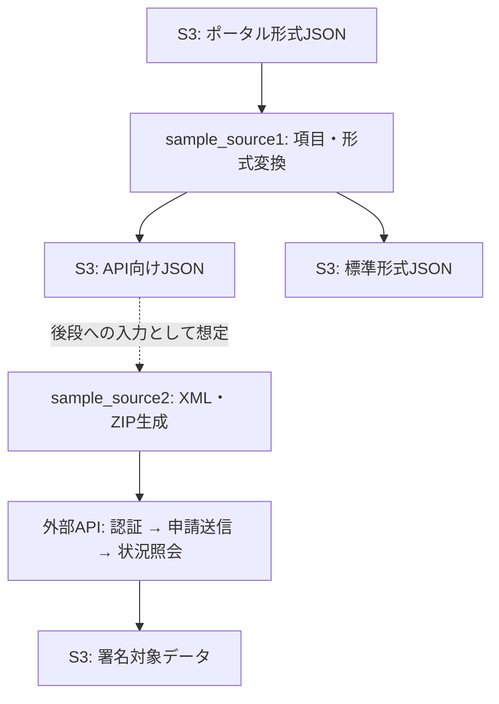

# Goによる申請データ変換・外部API連携サンプル

## 概要

あるプロジェクトで作成したGoプログラムを抽象化したサンプルです。申請データをAmazon S3から取得し、用途別のJSONや申請用XMLへ変換して、外部APIへ連携する処理を収録しています。

コードには住所変更や電力サービスに関する項目が含まれています。業務固有の項目を別のデータ形式へ対応付ける処理と、AWS Lambda・S3を使ったファイル連携の構成を読み取れます。地名・サービスコード・フォームIDなどには固定値や空欄があり、実システムの仕様を完全に再現するものではありません。

本書は収録コードの静的解析に基づきます。旧READMEにあった「署名済みファイルの送信・電子ファイルの取得」に相当する処理は、現在のコードには確認できません。

## 全体の流れ

両サンプルは独立した `package main` で、`lambda.Start(HandleRequest)` を起点にS3イベントを受け取ります。入出力形式から上記の接続が想定されますが、S3イベント通知やLambdaのデプロイ設定は含まれていません。

## ファイル構成

| パス | 役割 |
| --- | --- |
| `sample_source1/sample_source1.go` | S3入出力、ポータル形式から2種類のJSONへの変換 |
| `sample_source1/data.go` | `Portal`・`Standard`・`Api` のJSON用構造体 |
| `sample_source2/sample_source2.go` | XML変換、ZIP作成、HTTP API呼び出し、状況照会、S3保存 |
| `sample_source2/data.go` | API向けJSON、XMLフォーム、API応答の構造体と変換補助関数 |
| `AGENTS.md` | コントリビューター向けガイド |

## sample_source1：申請JSONの形式変換

1. S3イベントの先頭レコードからバケット名とキーを取得し、JSONを読み込みます。
2. `Portal` 構造体にデコードします。入力項目は `K0001` などの識別子で表現されています。
3. `Cnv2Api` で氏名・住所の結合、日付の分割、性別の文字列化、電話番号の分割を行います。
4. API向けJSONを `OUTPUT_DIR + "FMT_" + 入力ファイル名` に保存します。
5. `Cnv2Standard` で `Kxxxx` を `Dxxxx` に対応付け、一部の日付を `/` 区切りから `-` 区切りへ変換します。
6. 標準形式JSONを `OUTPUT_BETA_DIR + "FMT_std_" + 入力ファイル名` に保存します。

出力先バケットは `BUCKET` です。API向け変換には `東京都`・`●●市`・`世帯主` などの固定値があり、構造体の全項目が設定されるわけではありません。このサンプル自身は外部APIを呼び出しません。

## sample_source2：申請書生成と外部API連携

1. S3からAPI向けJSONを取得し、`Api` 構造体にデコードします。
2. `newSinseiDataStruct` と `newSinseiInfoDataStruct` でフォームのひな形を作成します。
3. `CnvJSON2Xml` で申請者情報と申請情報をフォームに設定します。和暦への変換、月日の先頭ゼロ除去、性別表記の変換も行います。
4. `compress` で `sinsei.xml`、`sinsei_info.xml`、空の `Attachment/` ディレクトリをメモリ上のZIPにまとめます。
5. `API_PASS` をSHA-256の16進表現に変換し、認証APIからアクセスキーを取得します。
6. 申請送信APIへZIPなどをmultipart形式で送信し、仮受付番号を取得する構成です。
7. 仮受付番号を使って処理状況を繰り返し照会します。
8. 取得した `file_for_signature` をBase64デコードし、S3に保存します。

出力キーは `OUTPUT_DIR + "SIGN_TGT_" + 入力のベース名（.json除去） + "_" + 仮受付番号 + ".dat"` です。ここで保存するのは署名対象データであり、署名の生成や署名済みデータの再送信は実装されていません。

### 状況照会の分岐

| ステータス | コード上の処理 |
| --- | --- |
| `001` / `002` | `SLEEP_TIME` 秒待って再照会 |
| `003` | 電子署名待ちとして署名対象データを取得し、ループ終了 |
| `999` | 入力チェックエラーを記録し、仮受付番号を保存用変数に入れてループ終了 |
| その他 | 想定外のステータスを記録してループ終了 |

照会回数が `MAX_RETRY_CNT` を超えるとエラーを返します。`999` と想定外ステータスでも後続のデコード・保存に進むため、正常系とは区別して確認が必要です。

## 設定と依存関係

| 環境変数 | 対象 | 用途 |
| --- | --- | --- |
| `BUCKET` | 両方 | 出力先S3バケット |
| `OUTPUT_DIR` | 両方 | API向けJSON、または署名対象データの出力プレフィックス |
| `OUTPUT_BETA_DIR` | 1 | 標準形式JSONの出力プレフィックス |
| `PROVIDER_ID` | 2 | 認証・API送信に使う事業者ID |
| `API_PASS` | 2 | 認証用パスワード |
| `URL_AUTH` / `URL_APPLI` / `URL_REF` | 2 | 認証・申請送信・状況照会APIのURL |
| `MAX_RETRY_CNT` | 2 | 状況照会の最大回数 |
| `SLEEP_TIME` | 2 | 再照会の待機秒数 |

プレフィックスはファイル名に直接連結されるため、ディレクトリとして扱う場合は末尾の `/` を設定します。入力バケットは環境変数ではなくS3イベントから取得します。

S3クライアントのリージョンは東京（`ap-northeast-1`）固定です。書き込みには `private` ACLと `AES256` のサーバー側暗号化を指定しています。

外部依存は `github.com/aws/aws-lambda-go`、`github.com/aws/aws-sdk-go`、およびsample_source1の `github.com/zenwerk/jptel` です。`go.mod`、依存バージョン、テスト、CI・デプロイ定義は未収録です。実行には依存関係の整備、S3アクセス権限、環境変数、外部APIの仕様・接続先が必要です。ビルドや外部サービスへの接続検証は行っていません。

## 再利用時の確認点

以下は収録コードから確認できる点です。抽象化時の置換によるものか、元の実装にも存在したものかは判断できません。

- **送信項目名の不整合**：`callApplSet` のmapは `city_service_code` / `application_zip` を定義していますが、読み出しは `service_code` / `sinsei_zip` です。存在しないキーから得たnilのReaderを `io.Copy` に渡すため、そのままでは送信処理でpanicする可能性があります。
- **入力検証**：S3イベントは `Records[0]` のみ処理します。空イベントの確認や複数レコードの処理はありません。日付文字列の固定位置スライスも、短い入力ではpanicする可能性があります。
- **エラー処理**：電話番号解析、数値変換、Base64デコード、一部の読み書きのエラーを無視しています。認証APIはHTTP 200以外でも空のアクセスキーとnilエラーを返します。申請送信APIの400応答は、読み取り済みのBodyを再デコードしています。
- **通信と待機**：HTTPクライアントに明示的なタイムアウトがなく、Lambdaの `ctx` もリクエストや待機に反映されていません。状況照会の本文読み取り失敗時には `log.Fatal` でプロセスを終了します。
- **業務ルールとフォーム**：和暦は年だけで判定するため、改元日の境界を扱えません。フォームへの代入は配列の固定添字に依存し、ひな形の並び順変更の影響を受けます。
- **ログと再実行**：アクセスキーやAPI応答本文のログ出力があります。再実行時の外部APIへの重複申請を防ぐ仕組みは確認できません。

再利用する場合は、まず変換関数の正常値・空値・不正値のテストと、HTTP通信を模擬したAPI連携テストを追加し、実際のスキーマと応答仕様に照らして確認してください。
